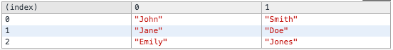

## Console

#### Log the value of a variable to the console
##### [console.log()](https://developer.mozilla.org/en-US/docs/Web/API/Console/log)
```js
var num = 2;
console.log("The value of num is", num);
// Logs to the console: The value of num is 2
```

<br>
#### Log the properties of an object to the console
##### [console.dir()](https://developer.mozilla.org/en-US/docs/Web/API/Console/dir) 
```js
var str = new String("hello");
console.dir(str);
// Logs to the console:
```


<br>
#### Display the contents of an array (must contain multiple arrays or objects) in a table
##### [console.table()](https://developer.mozilla.org/en-US/docs/Web/API/Console/table) 
```js
var people = [
  ["John", "Smith"], 
  ["Jane", "Doe"], 
  ["Emily", "Jones"]
];
console.table(people);
// Logs to the console:
```


```js
var people = [
  { name: "John Smith", age: 25 },
  { name: "Jane Doe", age: 66 },
  { name: "Emily Jones", age: 14 }
];
console.table(people);
// Logs to the console:
```


```js
var people = [
  { name: "John Smith", age: 25, weight: 160 },
  { name: "Jane Doe", age: 66, weight: 110 },
  { name: "Emily Jones", age: 14, weight: 105 }
];
console.table(people, ["name", "weight"]); // If restricting to only one specific column, a string with the property name works
// Logs to the console:
```


<br>
#### Group log messages
##### [console.group()](https://blog.mariusschulz.com/2014/11/25/advanced-javascript-logging-using-console-group) 
```js
console.group("URL Details");
console.log("Scheme: HTTPS")
console.log("Host: example.com");
console.groupEnd();
// Logs to the console:
```


```js
// Collapse the group by default
console.groupCollapsed("URL Details");
console.log("Scheme: HTTPS")
console.log("Host: example.com");
console.groupEnd();
// Logs to the console:
```


```js
console.group("URL Details");   
console.log("Scheme: HTTPS")
console.log("Host: example.com");

// Nested group
console.group("Query String Parameters");
console.log("foo: bar")
console.log("value: 42");
console.groupEnd();

console.groupEnd();
// Logs to the console:
```


<br>
#### Clear the console
##### [console.clear()](https://developer.mozilla.org/en-US/docs/Web/API/Console/clear) 
```js
console.clear();
// Alternatively, the keyboard shortcut Cmd-K will clear the console also
```

<br>
#### Set a counter
##### [console.count()](https://developer.mozilla.org/en-US/docs/Web/API/Console/count) 
```js
console.count("page load");
// Logs to the console:
```


