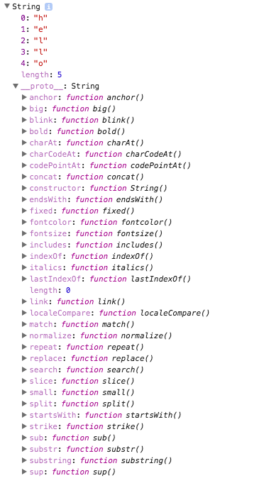

## Logging

#### Log the value of a variable to the console
##### [console.log()](https://developer.mozilla.org/en-US/docs/Web/API/Console/log)
```js
var num = 2;
console.log("The value of num is", num);
// Logs to the console: The value of num is 2
```

#### Log the properties of a specified object to the console
##### [console.dir()](https://developer.mozilla.org/en-US/docs/Web/API/Console/dir) 
```js
var str = new String("hello");
console.dir(str);
// Logs to the console:
```

