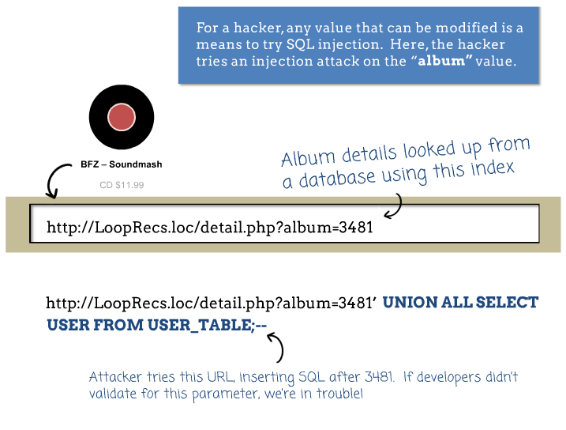
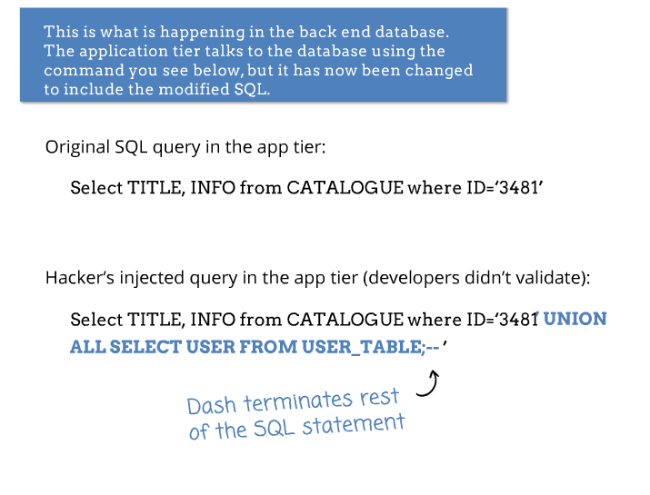
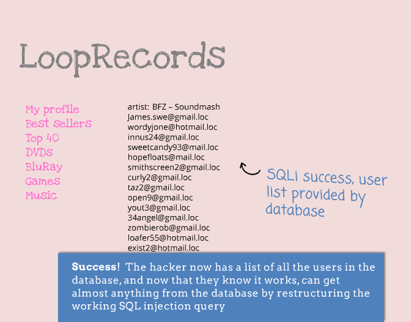
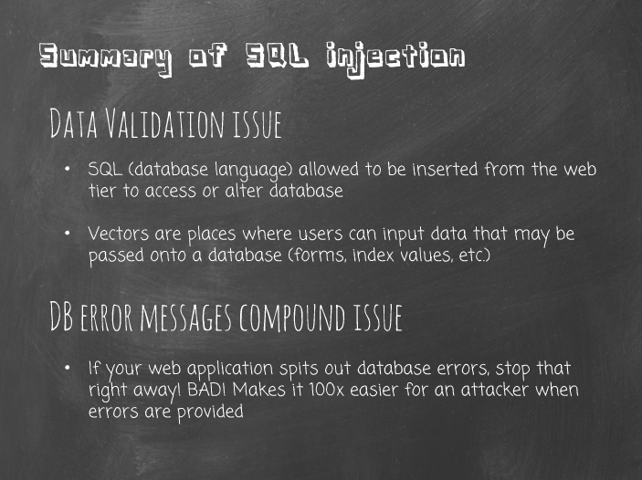
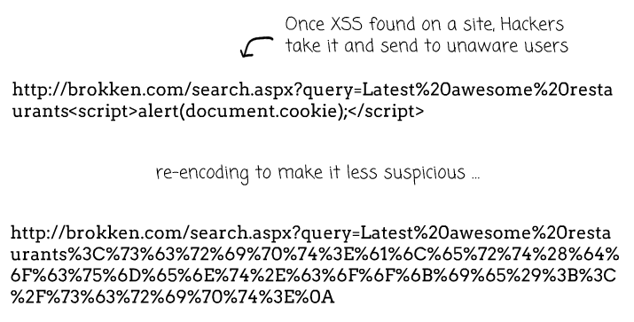
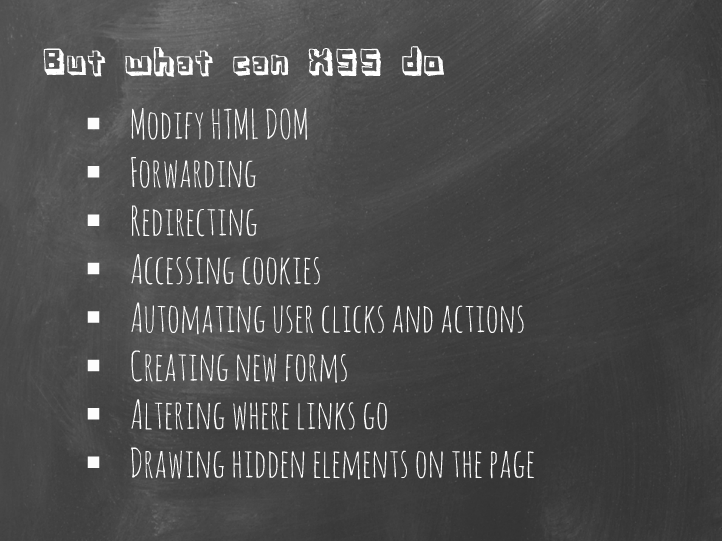
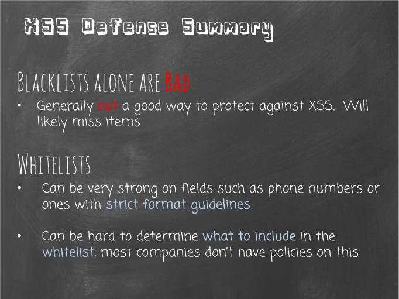
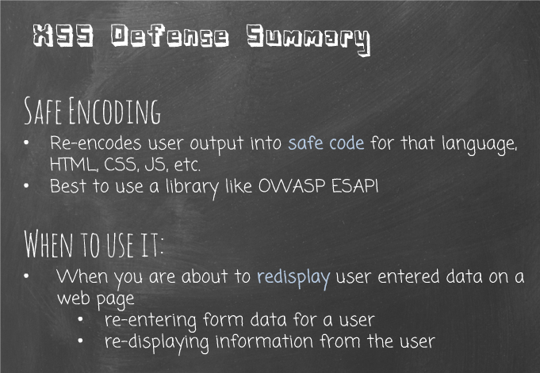

## Security

### Links
| Name          | Link                                                            |
|---------------|-----------------------------------------------------------------|
| Security Compass - SQL Injection | http://www.securitycompass.com/training/free/course-demos/modules/SQL_Injection/player.html |
| Security Compass - XSS Attacks | http://www.securitycompass.com/training/free/course-demos/modules/XSS/player.html |
| OWASP - ESAPI Library | https://www.owasp.org/index.php/Category:OWASP_Enterprise_Security_API#tab=Downloads |

### SQL Injection

SQL Injection is a strategy that hackers use to take control of the database through form fields, links, URL parameters, or any other means that query the database.

Hackers will write a closing quote followed by their own SQL command into either a form field, at the end of a URL which has a URL parameter, for example. Then they have full control over the database.

 

Ways to defend against a SQL Injection:
  * Disable error messages on production environment
  * Use prepared statements / parameterized queries at all times when dealing with user-entered input
  * Don't dynamically build any SQL strings
  
 

### XSS (Cross-site Scripting) Attacks

XSS attacks are strategies that hackers use to insert their own javascript code onto the users machine via two ways:

* Reflected XSS
  * When malicious code (html with javascript) is contained in the URL, which is used to interpret what to display on the screen
    * Example case: A search field where the next page re-displays the search term entered
    * Example search value entered: `This is my search string `
    * Commonly use case: When added to a link (as a query string) that is sent for others to click on. The link will be to your site so people will usually trust it. Once people click on it, it will take them to your site and will use the entered information to re-display on the page while executing the malicious code.
      * Requires the search terms to use a GET variable to access the information to re-display
      * Hackers will usually encode the html so it is not obvious as being malicious.
      
* Stored XSS
  * When malicious code (html with javascript) is saved into the DB through the use of form fields, which is later used to display to other users
    * Example case: A form field where the value is saved to the DB. The entered text value is later re-displayed to other users when they view a page which contains the user-entered information.
    * Example search value entered: `This is my search string `
    * Common use case: A form field on a social medium, such as a message board or forum entry, or blog post comment.

A XSS attack can be very powerful and includes many actions a hacker can take once their malicious code is running on your site user's browser

Using either of the XSS attack strategies, if the site developers aren't properly re-encoding user-entered values before re-displaying them on the screen, then any malicious code that is entered will be run when the information is displayed. Follow these steps to defend against it:

* Whitelist characters that are allowed
* Encode user-entered input before displaying it on screen
* Set cookies to HTTP Only so JavaScript doesn't have access to them

